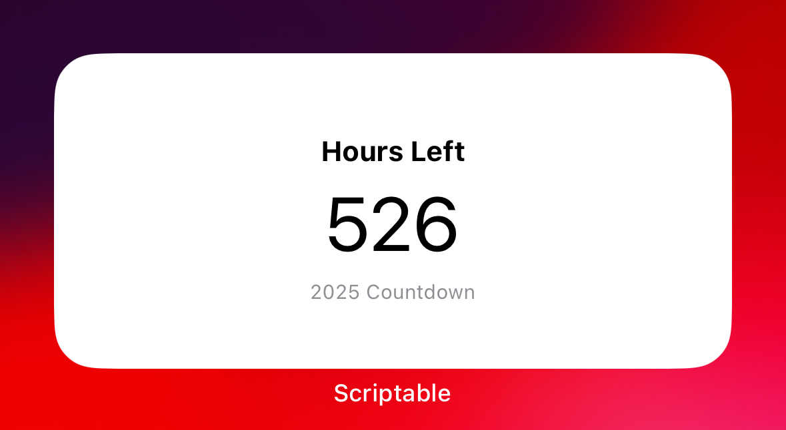
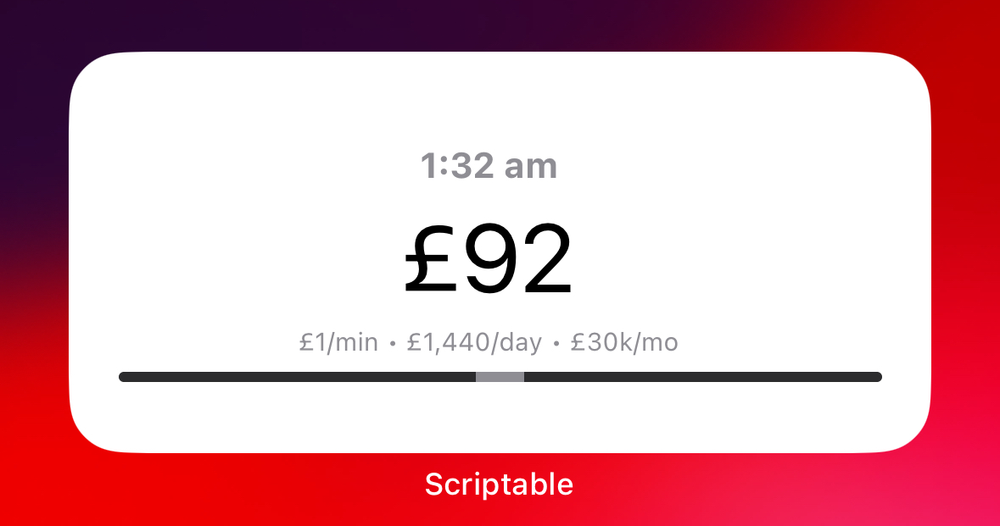
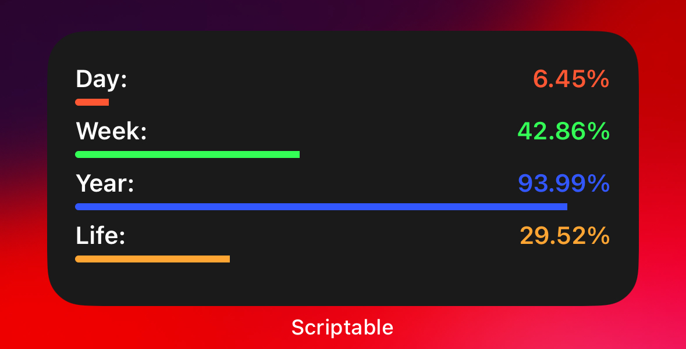

# iOS Widgets (Scriptable)

A set of Scriptable widgets to make time and money feel real:

- Countdown of hours left in the year
- Live "£ per minute" tracker for a £30k/month target
- Life percentage tracker based on your date of birth

---

## Widgets

### Hours Left 2025 / 2026

Shows how many hours are left until the end of the year so you stop pretending you have unlimited time.

Scripts:

- `Hours-Left-2025`
- `Hours-Left-2026`

Screenshot:

---

### £ per Minute – £30k/month Pace

Shows how much you’ve “earned” today if you were making **£1 per minute** (~£1,440/day, ~£30k/month).

Script:

- `£-per-minute-£30k`

Screenshot:

---

### Life Left %

Shows what percentage of your life has already passed, based on your DOB and target life expectancy.

Script:

- `Life-left-%`

Screenshot:

---

## How to Use

1. Install **Scriptable** from the iOS App Store.
2. Download or copy the script files from this repository into Scriptable.
3. Edit each script to set:
   - Your **date of birth**
   - Your **target life expectancy**
   - Your **income target** (for the £/min widget, default is £30k/month).
4. On your iPhone home screen, add a **Scriptable** widget:
   - Long-press home screen → **+** → search for **Scriptable**.
   - Choose the widget size.
   - Edit the widget and select the corresponding script.
5. Optional: set the widget to **refresh often** so the numbers stay aggressive and in your face.

---

## License

Do whatever you want with these scripts. If you ship something cool with them, credit is appreciated but not required.
